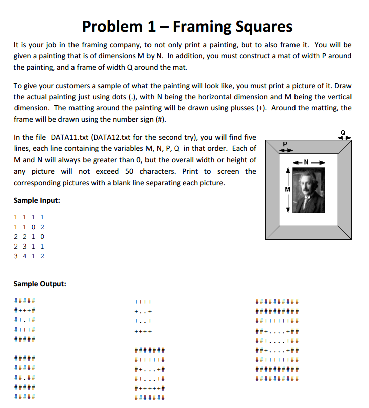

[Source via ECOO (Page 2)](http://ecoocs.org/contests/ecoo_2010.pdf)



## **Problem 1 – Framing Squares**

It is your job in the framing company, to not only print a painting, but to also frame it. You will be
given a painting that is of dimensions M by N. In addition, you must construct a mat of width P around
the painting, and a frame of width Q around the mat.

To give your customers a sample of what the painting will look like, you must print a picture of it. Draw
the actual painting just using dots (.), with N being the horizontal dimension and M being the vertical
dimension. The matting around the painting will be drawn using plusses (+). Around the matting, the
frame will be drawn using the number sign (#).

In the file DATA11.txt (DATA12.txt for the second try), you will find five
lines, each line containing the variables M, N, P, Q in that order. Each of
M and N will always be greater than 0, but the overall width or height of
any picture will not exceed 50 characters. Print to screen the
corresponding pictures with a blank line separating each picture.


Sample Input:

```
1 1 1 1
1 1 0 2
2 2 1 0
2 3 1 1
3 4 1 2
```

Sample Output:
```
#####
#+++#
#+.+#
#+++#
#####

#####
#####
##.##
#####
#####

++++
+..+
+..+
++++

#######
#+++++#
#+...+#
#+...+#
#+++++#
#######

##########
##########
##++++++##
##+....+##
##+....+##
##+....+##
##++++++##
##########
##########
```

Usage:

```
g++ -o FramingSquares FramingSquares.cpp
./FramingSquares <file_name/DATA11.txt>
```
