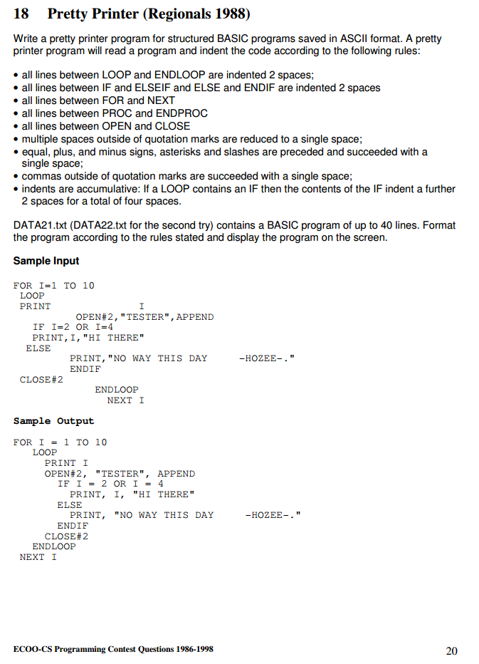

[Source via ECOO (Page 20)](http://ecoocs.org/contests/ecoo_pre1999.pdf)



## **18 Pretty Printer (Regionals 1988)**

Write a pretty printer program for structured BASIC programs saved in ASCII format. A pretty
printer program will read a program and indent the code according to the following rules:

- all lines between LOOP and ENDLOOP are indented 2 spaces;
- all lines between IF and ELSEIF and ELSE and ENDIF are indented 2 spaces
- all lines between FOR and NEXT
- all lines between PROC and ENDPROC
- all lines between OPEN and CLOSE
- multiple spaces outside of quotation marks are reduced to a single space;
- equal, plus, and minus signs, asterisks and slashes are preceded and succeeded with a
single space;
- commas outside of quotation marks are succeeded with a single space;
- indents are accumulative: If a LOOP contains an IF then the contents of the IF indent a further
2 spaces for a total of four spaces.

DATA21.txt (DATA22.txt for the second try) contains a BASIC program of up to 40 lines. Format
the program according to the rules stated and display the program on the screen.

Sample Input

```
FOR I=1 TO 10
 LOOP
 PRINT I
          OPEN#2,"TESTER",APPEND
   IF I=2 OR I=4
   PRINT,I,"HI THERE"
  ELSE
         PRINT,"NO WAY THIS DAY -HOZEE-."
         ENDIF
 CLOSE#2
             ENDLOOP
               NEXT I
```

Sample Output
```
FOR I = 1 TO 10
  LOOP
    PRINT I
      OPEN#2, "TESTER", APPEND
        IF I = 2 OR I = 4
          PRINT, I, "HI THERE"
        ELSE
          PRINT, "NO WAY THIS DAY -HOZEE-."
        ENDIF
     CLOSE#2
  ENDLOOP
NEXT I
```
ECOO-CS Programming Contest Questions 1986-1998 20

-----

Usage:

Set `USE_REGEX` to `true` to use a regular expression method to solve the problem. Otherwise a stack-based, algorithm will be used.

```
g++ -o PrettyPrinter PrettyPrinter.cpp
./PrettyPrinter <file_name/DATA21.txt>
```
